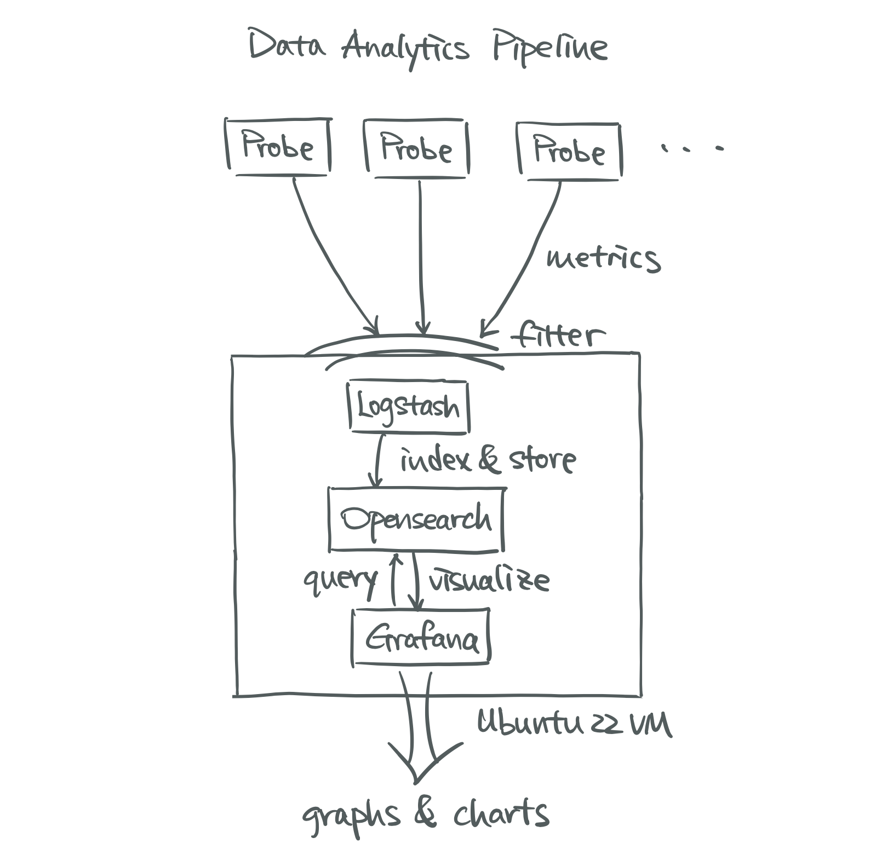

# pSSID Data Analytics Pipeline
A data analytics pipeline for pSSID that receives, stores, and visualizes WiFi
test metrics gathered by Raspberry Pi WiFi probes.

<p align="center">
</img>
</img>
</p>

Picture on the left is an overview of the entire pSSID architecture with the
role of this data analytics pipeline highlighted. In short, it receives test results
(metrics) gathered by the probes, stores and visualizes them.

Picture on the right is the architecture of the pipeline itself. It leverages the
idea of the ELK stack, simply replacing `Elasticsearch` and `Kibana` with `Opensearch`
and `Grafana`, resepctively.

## Requirements
The setup of the pipeline assumes that you have a virtual machine running Ubuntu 22
and that the machine has Docker installed.

## Installation
1. Clone this repository to the machine you would like to host the pipeline on. Each
service has its own `docker-compose` file for better modularization. If demand
changes, say you need more `Opensearch` nodes, you could simply provision more nodes
without touching other components of the pipeline.

2. Set passwords for `Opensearch`, which is required since version 2.12.0.
The easiest way to do so is with environment variables. Add the following lines to
your `.bashrc` file. This documentation uses `admin` as the username
and `OpensearchInit2024` as the password for demonstration.
```
export OPENSEARCH_INITIAL_ADMIN_PASSWORD=OpensearchInit2024
export OPENSEARCH_USER=admin
export OPENSEARCH_PASSWORD=OpensearchInit2024
```

Open `opensearch-one-node.yml` and edit the TODO item.
```
# TODO: add your initial admin password here. Using an environment variable is
# recommended. Hardcoding is fine if on a closed machine.
- OPENSEARCH_INITIAL_ADMIN_PASSWORD=<YOUR_PASSWORD>
```

3. Configure `Logstash`. Create a directory on the host machine,
say `logstash-pipeline`, with at least a
`logstash.conf` file in it. `logstash.conf` contains input, output sources, and
custom filters you would like to implement. A sample file is provided inside the
directory `logstash-pipeline`.

Open `logstash.yml` and edit the following TODO items.

First mount the directory you just created to the `pipeline` directory inside the
container.
```
# TODO: mount your pipeline directory into the container. USE ABSOLUTE PATH!
- <ABS_PATH_TO_YOUR_PIPELINE_DIRECTORY>:/usr/share/logstash/pipeline
```

Then set the username and password for access to `Opensearch` as the ones
defined earlier.
```
# TODO: set your opensearch username and password here.
- OPENSEARCH_USER=<YOUR_USERNAME>
- OPENSEARCH_PASSWORD=<YOUR_PASSWORD>
```

4. No configuration is required for `Grafana`.

5. Start the three components of the service with
`docker-compose`.

```
docker-compose -f <path-to-opensearch.yml> up -d
docker-compose -f <path-to-logstash.yml> up -d
docker-compose -f <path-to-grafana.yml> up -d
```
OPTIONAL: you could also start the opensearch dashboard in the same way.
```
docker-compose -f <path-to-opensearch-dashboard.yml> up -d
```

## Usage
### `logstash.conf`
### Filebeat
### Grafana
